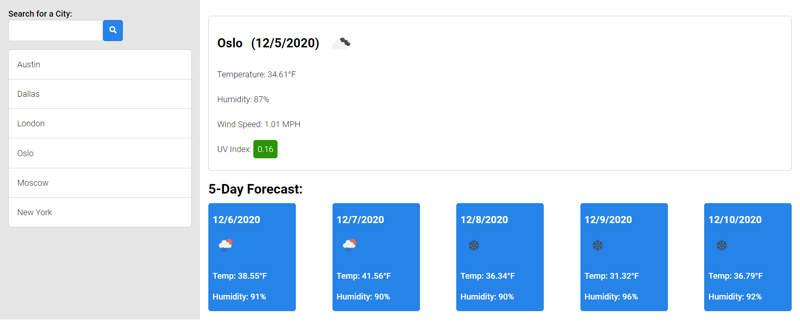

# weather-forecast

## Description
A weather application that displays current and 5-day weather forecast for user-inputted cities.  Enter city name in input field and current weather data and a 5 day forecast will be displayed for that city.  The city's name will be added to a list that will persist between browsing sessions and clicking on the city's name in the list will bring up the weather data in the UI.

##### Forecast Details View

##### View

##### View

Visit site [here](https://christopherconcannon.git
hub.io/weather-forecast/)

## Table of Contents
  * [Installation](#installation)
  * [Usage](#usage)
  * [License](#license)
  * [Technologies](#technologies)
  * [Contributing](#contributing)
  * [Testing](#testing)
  * [Questions](#questions)
  
## Installation
Clone project to a directory on your local machine and cd into weather-forecast directory.  

## Usage
Open index.html file in browser of your choice.  Enter city into search input field and weather details for the 5-day weather forecast will appear in main area.  City name will be added to a list of previous searches and will be clickable to show details again.  Previous searches will persist with browser refresh through Local Storage.

## License 
This project is covered under the MIT license 

## Technologies 
HTML5, CSS3, JavaScript, Local Storage

## Contributing
To see the guidelines adopted for contributing to this project, please view the [Contributor Covenant](https://www.contributor-covenant.org/version/2/0/code_of_conduct/code_of_conduct.txt)

## Testing
Tests coming soon

## Questions
Visit me at GitHub  
[christopherConcannon](https://github.com/christopherConcannon)
  
If you have any questions or would like to contact me, please email me at  
[cmcon@yahoo.com](mailto:cmcon@yahoo.com)

